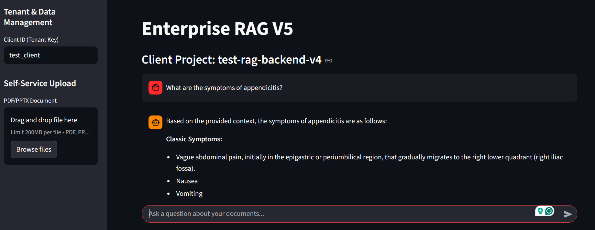

# Demo RAG V5 – Multi‑Tenant Retrieval-Augmented Generation Service (GCP | Gemini 2.5 | Firestore Vector Search)

Demo RAG V5 is a production-style RAG system demonstrating **streaming ingestion**, **parent–child vector indexing**, **multi‑tenant isolation**, and **dual‑write storage decoupling** on Google Cloud Platform.  
This repository contains the **Dispatcher**, **Ingestion Worker**, **Retrieval API**, **Streamlit Demo UI**, and **Terraform IaC** for the entire end‑to‑end system.

---

## 🧠 Architecture Overview

### **Workflow Diagram**


### **Demo Screenshot**


---

## 🚀 Key Features

- **Multi‑Tenant RAG Backend** using Firestore Vector Search with strict `client_id` filtering  
- **Parent–Child Chunking** for high‑recall retrieval with low token usage  
- **Dual‑Write Architecture (V5)**:  
  - Firestore → real‑time vector search  
  - GCS Parquet → long‑term, scalable indexing for V6 migration  
- **Asynchronous Ingestion Pipeline** using Eventarc → Cloud Run Dispatcher → Pub/Sub → Cloud Run Worker  
- **Gemini 2.5 Pro** for grounded, contextual responses  
- **Streamlit Demo UI** showcasing upload, retrieval, conversation history, and per‑tenant isolation  
- **Full IaC** with Terraform provisioning Cloud Run services, Pub/Sub, buckets, IAM bindings  

---

## 📂 Repository Structure

```
ai-empower-rag-v5/
│
├── docs/                               # All design, SRS, TDD documentation
│   ├── DM - AI Empower - RAG V4.pdf
│   ├── DM - AI Empower - RAG V5.pdf
│   ├── DM - AI Empower - Test RAG V4.pdf
│   ├── SRS - AI Empower - RAG V4.pdf
│   ├── SRS+TDD - AI Empower - RAG V5.pdf
│   ├── TDD - AI Empower - RAG V2.pdf
│   ├── TDD - AI Empower - RAG V3.pdf
│   └── TDD - AI Empower - RAG V4.pdf
│
├── frontend_app/                       # Streamlit demo UI
│   ├── app.py
│   └── requirements.txt
│
├── images/                             # Workflow diagrams + screenshots
│   ├── Burns_Greg_CS_DemoRAG_V5.svg
│   └── Burns_Greg_CS_DemoRAG_V5_screen.png
│
├── src/
│   ├── ingestion-dispatcher/           # Cloud Run Dispatcher
│   │   ├── Dockerfile
│   │   ├── main.py
│   │   └── requirements.txt
│   │
│   ├── ingestion-worker/               # Worker: chunking, embeddings, dual-write
│   │   ├── Dockerfile
│   │   ├── main.py
│   │   └── requirements.txt
│   │
│   └── retrieval-api/                  # Retrieval API service
│       ├── Dockerfile
│       ├── main.py
│       └── requirements.txt
│
├── terraform/                           # Infrastructure-as-Code
│   ├── iam.tf
│   ├── main.tf
│   ├── outputs.tf
│   ├── provider.tf
│   └── variables.tf
│
└── README.md
```

---

## 🧪 Running Locally

### **1. Start the Retrieval API**
```bash
uvicorn src.retrieval-api.main:app --reload --port 8080
```

### **2. Launch the Streamlit Demo**
```bash
streamlit run frontend_app/app.py
```

---

## 🌩 Ingestion Flow (Cloud Deployment)

1. Upload file → GCS `/uploads/{client_id}/...`  
2. Eventarc triggers **Dispatcher**  
3. Dispatcher publishes page-level jobs to Pub/Sub  
4. Worker extracts text, performs parent–child chunking, generates embeddings  
5. Dual-write:  
   - Firestore Vector Search  
   - GCS Parquet  
6. Retrieval API searches vector index + resolves parent chunks  
7. Gemini 2.5 Pro generates grounded answers  

---

## 🔍 What This Project Demonstrates

- Real-world RAG system engineering  
- Multi-tenant design and isolation  
- Event-driven ingestion and fan-out processing  
- Vector search with future-proofing through storage decoupling  
- Practical LLM integration using Gemini 2.5 Pro  
- Cloud Run microservice architecture  
- Full Terraform-managed infrastructure  

---

## 📎 Case Study & One-Pager

- **Full HTML Case Study:** `docs/Burns_Greg_CS_DemoRAG_V5.html`  
- **One‑Page Summary:** `docs/Burns_Greg_CS_1P_DemoRAG_V5.pdf`  
- **Demo:** https://demo-rag-v5.streamlit.app/  
- **Repository:** https://github.com/burnsgregm/ai-empower-rag-v5  

---

## © Authored by  
**Greg Burns — Machine Learning Engineer / Systems Architect**
